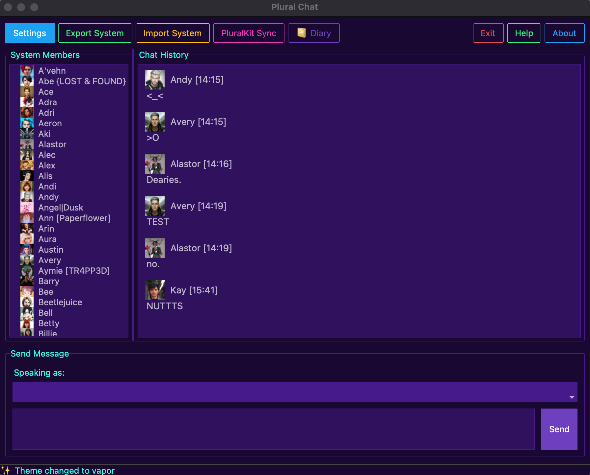
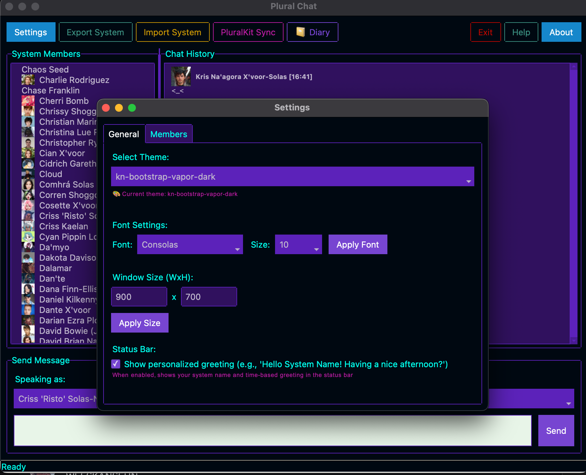
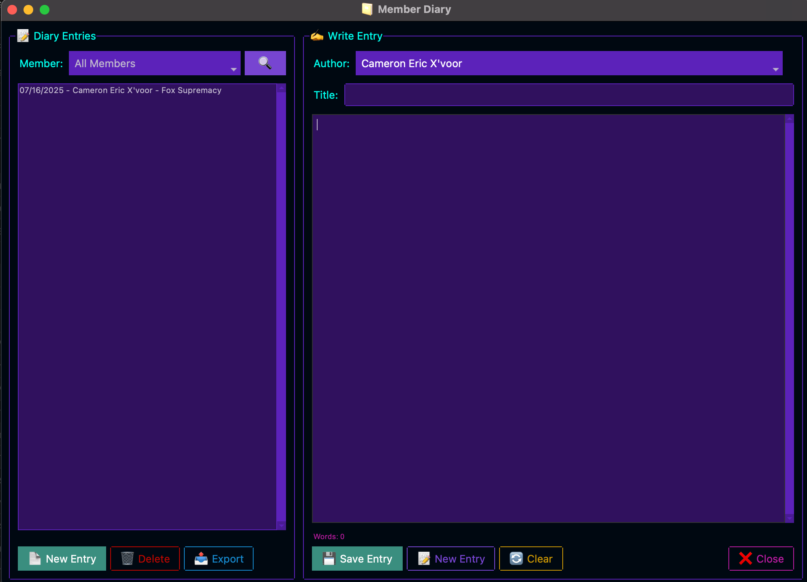
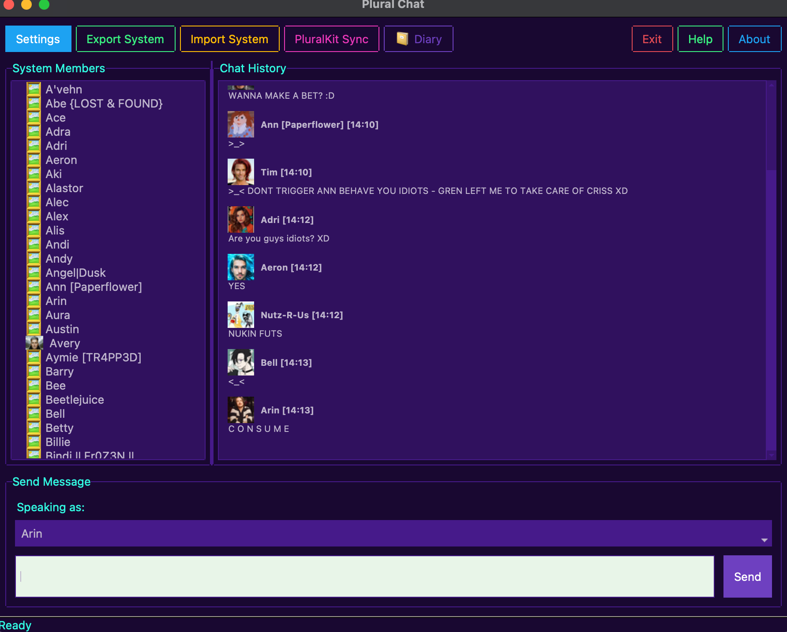
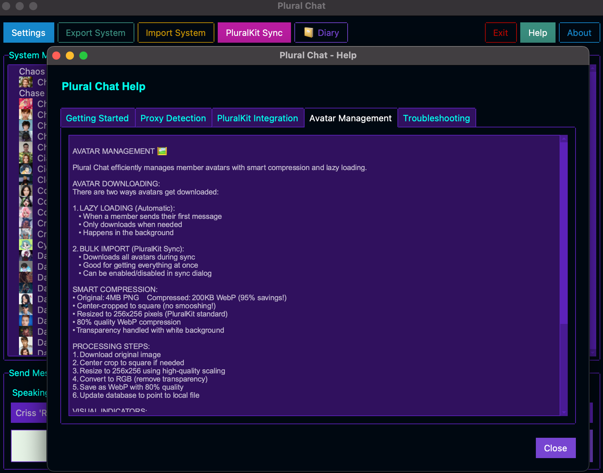

# 🗨️ Plural Chat

A desktop chat application designed specifically for plural systems, featuring PluralKit integration and intelligent proxy detection.

## ✨ Features

- **🏠 Local Desktop Chat** - Private conversations between system members
- **🔗 PluralKit Integration** - Import members, avatars, and proxy tags from your PK system
- **🎯 Smart Proxy Detection** - Automatic member switching based on proxy patterns
- **💾 SQLite Database** - Fast, reliable local storage
- **🎨 Modern Themes** - 15+ beautiful themes via ttkbootstrap
- **📤 Export/Import** - Share system configurations with other plural folks
- **🖼️ Avatar Support** - Display member avatars in chat
- **📔 Personal Diary** - Private journal system for individual members

## 📸 Screenshots

| Main Chat Interface | Settings & Custom Themes | Personal Diary System |
| :-----------------: | :----------------------: | :-------------------: |
|  |  |  |
| **Active Conversations** | **Help Documentation** | **Theme Showcase** |
|  |  |  |

## ⚠️ Known Issues

- **PluralKit Import**: Currently causes UI freezing during large imports. We're
   working on an async solution. For now, use smaller batches or be patient during
   imports.
- **Fix in progress**: Async/threading improvements coming in the next 24 hours!
- **Themes not applying properly, UI defaulting to darkmode**
- **Comhra of duskfall demands Criss sleeps so we'll do this tomorrow**

## 🚀 Quick Start

### Prerequisites

- Python 3.8 or higher
- pip (Python package installer)

### Installation

1. **Clone or download** this repository
   ```bash
   https://github.com/Ktiseos-Nyx/plural_chat.git
   ```
3. **Install:**
   ```bash
     cd plural_chat
     pip install .
   ```
4. **Run the application:**
   ```bash
   plural-chat
   ```
#### Developer Mode Options

   ```bash
  git clone https://github.com/Ktiseos-Nyx/plural_chat.git
  cd plural_chat
  pip install -e .
  plural-chat
   ```

### First Time Setup

1. **Add Members** - Use the Settings → Members tab to add your system members
2. **Set Avatars** - Add avatar images for visual identification
3. **PluralKit Sync** (Optional) - Import your existing PK system data via PK's API or via Json export via pk;export on Discord.
4. **Choose Theme** - Pick from 15+ modern themes in Settings

## 🎯 Proxy Detection

If you've imported from PluralKit or set up proxy tags, the app will automatically detect them:

- Type `member: hello there` → Auto-selects "member" and sends "hello there"
- Visual feedback shows when proxy is detected
- Clean messages without proxy tags in chat history

### Future Foward Issue
Not everyone uses member: proxy - so being that this was developed in less than 12 hours, it'd be amazing if anyone would want to help out in robustish level fix this!

## 🔧 PluralKit Integration

### API Token Setup

1. Get your PK token from [PluralKit Dashboard](https://dash.pluralkit.me/dash/token)
2. Click "PluralKit Sync" in the app
3. Enter your token and test connection
4. Choose "Sync Members" or "Full Import"

### What Gets Imported

- ✅ Member names and display names
- ✅ Pronouns and descriptions  
- ✅ Proxy tags for auto-detection
- ✅ Avatar images (downloaded locally)
- ✅ Member colors and metadata
- ✅ Chat history (if present in export)

## 📁 File Structure

- `app.db` - Application settings and preferences
- `system.db` - Your system's members and chat history  
- `avatars/` - Downloaded avatar images
- `*.json` - Export files for sharing

## 🎨 Themes

Choose from these beautiful themes:
- superhero, darkly, solar, cyborg, vapor
- pulse, flatly, journal, litera, lumen
- minty, morph, sandstone, united, yeti

## 📤 Sharing Systems

**Export your system:**
- Click "Export System" → Save as JSON
- Share file with other plural folks
- Includes members, chat history, and settings

**Import a system:**
- Click "Import System" → Select JSON file
- Supports PluralKit exports (auto-detects and converts)
- Our export format is compatible for re-importing

## 🛠️ Development

### Tech Stack

- **Python 3.8+** - Core language
- **ttkbootstrap** - Modern UI framework
- **SQLite** - Local database
- **Pillow** - Image processing
- **Requests** - PluralKit API integration

### Project Structure

```
plural_chat/
├── main.py                 # Main application
├── database_manager.py     # SQLite database handling
├── pluralkit_api.py       # PK API integration
├── pluralkit_dialog.py    # PK sync UI
├── pk_export_parser.py    # PK export file parser
├── member_manager.py      # Member management UI
├── settings_manager.py    # Settings UI
├── about_dialog.py        # About dialog
├── requirements.txt       # Python dependencies
├── pyproject.toml        # Project configuration
└── LICENSE               # MIT license
```

## 🤝 Contributing

We welcome contributions from the plural community! Whether it's:

- 🐛 Bug reports
- 💡 Feature suggestions  
- 🔧 Code improvements
- 📖 Documentation updates

## 📄 License

This project is licensed under the MIT License - see the [LICENSE](LICENSE) file for details.

For third-party components and attributions, see [NOTICES.md](NOTICES.md).

## 💝 Credits

- **Created by:** Duskfall Portal Crew
- **Inspired by:** The amazing plural community
- **Thanks to:** PluralKit team for the fantastic API
- **UI Framework:** ttkbootstrap developers

## 🔗 Links

- [PluralKit](https://pluralkit.me) - The bot that inspired this project
- [ttkbootstrap](https://ttkbootstrap.readthedocs.io) - Modern tkinter themes
- [Support us](https://ko-fi.com/duskfallcrew) - Help keep development going
- [Ktiseos Nyx](https://discord.gg/HhBSvM9gBY) - Development & Ai Discord which is Plural Friendly! 
- [Earth & Dusk Media](https://discord.gg/5t2kYxt7An) our Twitch & Media Discord, which both of our discords have PK enabled for proxying!

---

*Made with 💜 by and for the plural community*
